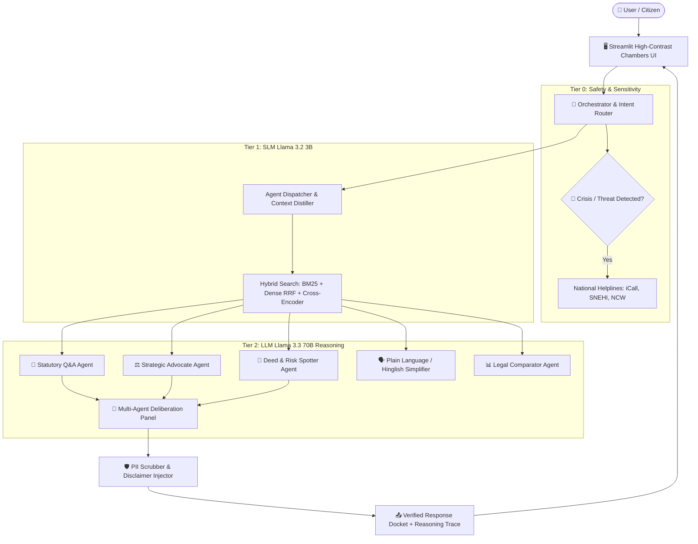

# Samata — System Architecture & Multi-Agent Deliberation Suite 🏛️

## 1. High-Level Architecture Diagram

---

## 2. Multi-Agent Deliberation Pipeline

When complex queries or separation agreements are submitted, the Orchestrator supports **Multi-Agent Tagging** (e.g. `@risk @advocate`).

1. **Step 1 — Risk Spotter Audit**: Identifies one-sided waiver clauses, statutory bars under Section 23/25 HMA, and adverse forfeiture terms.
2. **Step 2 — Strategic Advocate Cross-Evaluation**: Takes the flagged risks and stress-tests them from opposing counsel's perspective, highlighting evidentiary vulnerabilities and counter-claims.
3. **Step 3 — Synthesis & Docket Delivery**: Merges the findings into an actionable, color-coded courtroom briefing with clear disclaimers.

---

## 3. Data Flow & Security Boundaries
- **Ephemeral Session State**: Sessions exist solely in-memory (`st.session_state`) and terminate upon browser closure.
- **Zero Raw LLM Pass-Through**: All responses pass through statutory citation grounding and educational disclaimers.
