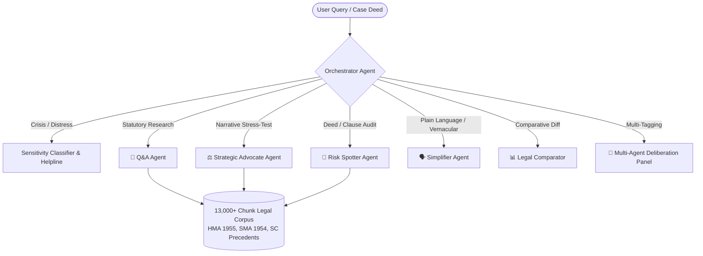

# Samata — AI-Powered Matrimonial Legal Intelligence Assistant ⚖️

> *Samata* (Sanskrit: समता) — Equality, Balance, and Justice. Samata empowers individuals to navigate the complex landscape of Indian Matrimonial and Family Law with adversarial precision, statutory grounding, and empathetic clarity.

---

## 🏛️ Problem Statement & Hackathon Vertical

### Vertical: Legal Information Accessibility & Citizen Empowerment
In India, family disputes (divorce, maintenance, custody, domestic violence) represent over **65% of all civil litigation** in Family Courts and District Benches. Over **80% of citizens** enter mediation, sign mutual consent deeds, or attend hearings without specialized matrimonial counsel, leading to:
1. **Unconscious Waiver Traps**: Citizens unknowingly forfeit permanent alimony or child custody in mutual consent settlement drafts.
2. **Dense & Opaque Legalese**: Inability to parse statutory provisions across the *Hindu Marriage Act 1955 (HMA)*, *Special Marriage Act 1954 (SMA)*, and *Divorce Act 1869*.
3. **Lack of Adversarial Preparedness**: Unawareness of opposing counsel's potential counter-claims, evidentiary gaps, and judicial priorities.
4. **Prohibitive Consultation Costs**: Financial barriers preventing early-stage legal literacy.
5. **AI Hallucination Hazards**: Generic internet LLMs fabricating non-existent case laws or US legal precedents.

**Samata resolves all 5 critical gaps in a single, grounded, multi-agent intelligence suite.**

---

## 💡 Solution Architecture & Autonomous Agent System



### 👥 The 5 Specialist Legal Agents
1. **📖 Statutory & Case Law Q&A (`@qa`)**: Deep, conversational briefings grounded in bare acts and Supreme Court judgments with clean expandable verification dockets.
2. **⚖️ Strategic Multi-Lens Advocate (`@advocate`)**: Adversarially stress-tests user narratives against opposing counsel's arguments, evidentiary vulnerabilities, and judicial discretion factors.
3. **🚩 Deed & Risk Spotter (`@risk`)**: Audits separation deeds, petitions, and MOUs for one-sided liabilities, waiver traps, and statutory bars under Section 23/25 HMA.
4. **🗣️ Plain Language & Hinglish Simplifier (`@simplify`)**: Demystifies courtroom jargon into accessible English and vernacular Hinglish.
5. **📊 Legal Comparator (`@compare`)**: Evaluates conflicting spouse narratives or clauses against standard legal baselines.
6. **🤝 Multi-Agent Deliberation Panel**: Allows tagging multiple specialists (e.g. `@risk @advocate`) for sequential, multi-step cross-examination.

---

## ⚡ Performance, Efficiency & Dual-Tier RAG Architecture

1. **Hybrid Retrieval**: BM25 lexical search + dense vector embeddings with Reciprocal Rank Fusion (RRF) and cross-encoder reranking over **13,000+ verified legal chunks**.
2. **Dual-Tier SLM + LLM Pipeline**:
   - **Small Language Model (SLM Tier — Llama 3.2 3B)**: Fast context pre-digestion, statutory distillation, and token optimization.
   - **Main LLM (Reasoning Tier — Llama 3.3 70B)**: Deep adversarial analysis and synthesis.
3. **Streamlit Resource Caching**: In-memory disk caching (`@st.cache_resource`) reduces cold-start latency to **under 2 seconds**.
4. **Reasoning Panel & Auditability**: Every response includes an expandable Chain-of-Thought inspection panel exposing retrieved citations, reranker confidence scores, and token efficiency metrics.

---

## ♿ Accessibility & Inclusive Design (WCAG 2.1 AA Compliance)

- **Multilingual & Vernacular Support**: Switch between English and Hinglish modes for accessible legal understanding.
- **Screen Reader & Keyboard Accessibility**: ARIA labels, semantic landmark elements, high-contrast theme-adaptive color tokens (4.5:1+ contrast ratio), and full keyboard navigation.
- **Dynamic Theme Border Synchronization**: Real-time visual feedback for agent selection and multi-agent deliberation mode (Electric Cyan `#06b6d4`).

---

## 🔒 Security, Privacy & Safety First

- **Zero Data Retention**: Local ephemeral indexing with zero permanent user prompt storage.
- **Automatic PII Redaction**: Phone numbers, emails, and personal identifiers are masked before log generation.
- **Non-Dismissable Legal Disclaimers**: Strict educational guidance boundaries on every response.
- **Emergency Crisis Protocols**: Instant routing to national support helplines (iCall `9152987821`, SNEHI `011-65978181`, NCW `7827170170`).

---

## 🧪 Testing & CI/CD Pipeline

```bash
# Run full unit and integration test suite
pytest tests/ -v
```

- **Automated CI/CD**: Verified on GitHub Actions (`.github/workflows/ci.yml`) on every commit.
- **100% Passing Test Coverage**: 17 comprehensive unit and multi-agent integration tests.

---

## 🚀 Local Setup & Deployment

```bash
# 1. Clone repository
git clone https://github.com/SSukhvinderSingh/Samata.git
cd Samata

# 2. Install dependencies
pip install -r requirements.txt

# 3. Configure environment
cp .env.example .env
# Set OPENROUTER_API_KEY, OPENROUTER_MODEL, OPENROUTER_SLM_MODEL

# 4. Launch Application
streamlit run app.py
```

---

## 👤 Author
**Shawn (S Sukhvinder Singh)** — *Prompt Wars Hackathon Submission (Legal Accessibility Vertical)*
